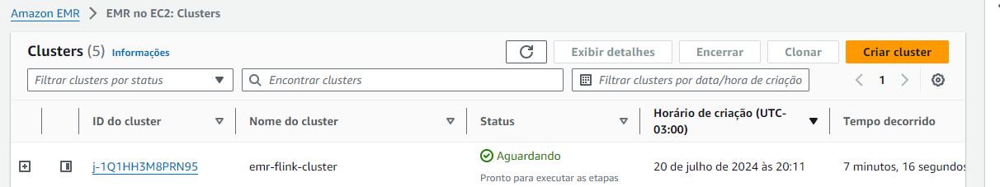
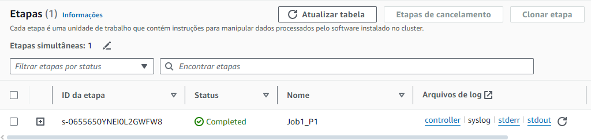
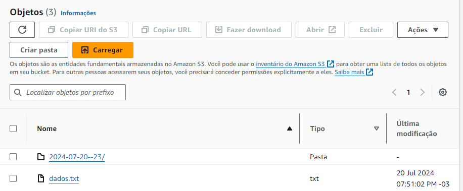

# Automatizando Infraestrutura de Processamento de Dados com AWS EMR e Apache Flink 🚀


### Qual o produto final desenvolvido?
- ♨️ Foi criada uma solução de infraestrutura para processamento de dados, que pode rapidamente ser provisionada com dois comandos(sim, isso mesmo, dois comandos), podendo ser utilizada e adaptada para os mais variados tipos de demandas, seja para processamento moderado, até grandes volumes de dados.


### Qual o objetivo principal ?
- 🚀 Esse projeto tem o objetivo principal de demonstrar um exemplo da automatização, configuração e o gerenciamento da infraestrutura necessária para executar pipelines de processamento de dados em lote e streaming, capazes de lidar com grandes volumes de dados com baixa latência.


- 📌 O processamento a ser realizado neste projeto, é um processamento simples visando a demonstração de como seria esse provisionamento e automação fim-a-fim de uma infraestrutura real! Com seu próprio script (em pyspark por exemplo), e claro, ajuste nas capacidades dos clusters (o que pode ser feito pelo próprio código 😉), a infraestrutura aprendida aqui pode ser utilizada para suportar pipelines de dados super robustas.
- ⚠️ **Cuidado!** Os serviços provisionados por esse projeto **NÃO** são gratuitos, apesar de ser um exemplo simples, justamente pra não incorrer grandes custos durante o estudo, deixar a infraestrutura rodando por cerca de 1 hora, pode gerar custos entre $0.70 a $1.10 Dólares (por hora), não é muito, mas não vai esquecer o cluster ligado em 🚨.

### O que você verá aqui?

- 📌 Demonstração passo a passo de como subir a infraestrutura, executar as intruções, como submeter steps para executar o processamento desejado e, após isso, destruição da infraestrutura.
### O que não terá aqui?
- 📌 Tutorial de como codar toda essa solução do zero, seria necessário um curso pra isso.

# Tecnologias Utilizadas

📌 AWS EMR

*O Amazon Elastic MapReduce (EMR) é um serviço de processamento de big data que facilita a execução de frameworks como Apache Hadoop, Apache Spark, Apache HBase, Apache Flink e Presto na nuvem AWS. Ele simplifica o processamento de grandes volumes de dados e fornece escalabilidade automática.*

📌 Apache Flink

*Apache Flink é um framework de processamento de fluxo e lote de dados em tempo real. Ele oferece capacidades avançadas para processamento de eventos, análise de dados em tempo real e operações de estado, permitindo aplicações de alta performance e baixa latência.*

📌Hadoop

*Apache Hadoop é uma plataforma de software de código aberto para armazenamento e processamento de grandes conjuntos de dados. Ele usa um sistema distribuído de arquivos (HDFS) e um modelo de programação MapReduce para processamento paralelo em clusters de computadores.*

📌 Docker

*Docker é uma plataforma que facilita a criação, a distribuição e a execução de aplicativos em contêineres. Os contêineres Docker permitem a execução consistente de aplicações em diferentes ambientes, garantindo isolamento e portabilidade.*

📌Terraform

*Terraform é uma ferramenta de infraestrutura como código (IaC) que permite criar, gerenciar e versionar a infraestrutura de forma declarativa. Com o Terraform, você pode definir a infraestrutura usando arquivos de configuração e automatizar a provisão e gerenciamento de recursos em provedores de nuvem como AWS, Azure e Google Cloud.*

📌Demais Recursos da AWS

*Outros recursos da AWS são necessários para subir essa infraestrutura, como instãncias EC2(utilizadas como cluster para o EMR), Vpc, IAM Roles, Grupos de Segurança, etc...*

Documentação:
* [AWS EMR](https://aws.amazon.com/pt/emr/)
* [Apache Flink](https://flink.apache.org)
* [Hadoop](https://hadoop.apache.org)
* [Docker](https://www.docker.com/)
* [Terraform](https://www.terraform.io)


## O que é necessário pra executar o projeto?

Dependências necessárias para rodar o projeto.

* Docker Desktop
* Conta na AWS

## Como Montar o Ambiente ✅

### Clone o Repositório
```
git clone https://github.com/Brunotorres15/emr-flink-aws.git
```

### Execute o comando abaixo para criar a imagem Docker

```
docker build -t emr-flink-aws-image:v1 .
```

### Execute o comando abaixo para criar o container Docker

```
docker run -dit --name emr-flink-aws-container -v ./IaC:/iac emr-flink-aws-image:v1 /bin/bash
```
NOTA: No Windows você deve substituir ./IaC pelo caminho completo da pasta

### Acesse o container docker e verifique a versão do Terraform com o comando

```
terraform version
```

## Provisionando uma Infraestrutura de processamento com AWS EMR e Apache Flink ✅


📌 Crie um bucket no S3 chamado **emr-logs-\<account-id>** e configure no arquivo **emr.tf**,
utilizaremos este bucket como uma fonte externa para guardar os logs do cluster. 

### Configure as suas credenciais de acesso à AWS via cli
```
aws configure
```

### Inicialize o Terraform
```
terraform init
```
### 🚀 Provisionando toda uma infraestrutura com dois comandos!

#### Cria o Plano de Execução do terraform e salva em disco

```
terraform plan -var-file config.tfvars -out terraform.tfplan
```
Obs: 
- *-var-file é pra indicar qual arquivo de configuração estamos utilizando pra buscar aos valores das variáveis que setamos.* 
- -out é o arquivo de saída que vai guardar nosso plano de execução.

### Executa o apply do plano de execução, informando nomavente o arquivo onde estão as variáveis (com auto-approve)

```
terraform apply -auto-approve -var-file config.tfvars
```

### Opcional: Executa o apply com o arquivo de variáveis (sem auto-approve)
```
terraform apply -var-file config.tfvars
```

### Cluster de pé e pronto pra receber os steps pra execução


# 😵‍💫 Tá, mas o que isso quer dizer?

#### 📌 Isso significa que com o Terraform, temos em nossas mãos toda uma infraestrutura robusta, personalizável e escalável, que podemos provisionar e destruir sempre que precisarmos dela, evitando assim, ter que provisionar tudo na mão toda vez que precisar subir clusters em nuvem. 🤯

## Agora que temos nossa infraestrutura, vamos acessar via SSH o cluster master e realizar alguns processamentos de exemplo ✅

#### 📌 No container Docker navegue até a pasta onde estão as chaves criadas no deploy do cluster ("generated/ssh")

#### Ajusta o privilégio da chave 
```
chmod 400 deployer
```

#### Conecta via SSH (coloque abaixo o endereço do seu cluster)
```
ssh -i deployer hadoop@ec2-3-14-29-59.us-east-2.compute.amazonaws.com
```

## Exemplo de execução de steps no EMR com o Apache Flink ✅

- Obs: Vamos usar o Hadoop (HDFS) pra armazenar o arquivo que vamos processar, desta forma ele é acessível por todas as instâncias do cluster. 
### Crie uma pasta como input no HDFS
```
hdfs dfs -mkdir /user/root/input
```

### Crie um arquivo txt como por exemplo:
```
vi dados.txt
```
- utilizei o vi para criar um arquivo de texto, mas você pode utilizar qualquer outro editor de texto, texto de exemplo:

```
IaC (Infraestrutura Como Código) nasceu no universo DevOps, mas rapidamente chegou à área de dados para ajudar no trabalho de Engenheiros de Dados, Engenheiros de Machine Learning, Arquitetos de Dados, Cientistas de Dados e Engenheiros de IA.

Neste curso você vai desenvolver suas habilidades com Terraform, uma ferramenta open-source que permite definir a infraestrutura como código usando uma linguagem simples e declarativa e implantar e gerenciar essa infraestrutura em uma variedade de provedores de cloud computing (em nuvem pública ou privada) e virtualização, com apenas alguns comandos.

Além do Terraform você vai trabalhar com AWS, Azure e Databricks através de diversos Labs e Projetos. O conhecimento que você irá adquirir neste curso vai colocá-lo muito a frente de outros profissionais do mercado, aumentando de forma considerável sua empregabilidade na área de dados, independente da sua função.

Este é um curso realmente único, praticamente um trabalho de consultoria para você, no padrão de qualidade da Data Science Academy.
```

### Copie o arquivo criado para o 

```
hdfs dfs -put dados.txt /user/root/input
```

### Vamos contar o número de ocorrências de cada palavra no arquivo, usando um script padrão que já vem com o Apache Flink
```
flink run -m yarn-cluster /usr/lib/flink/examples/streaming/WordCount.jar --input hdfs:///user/root/input/dados.txt --output hdfs:///user/root/saida/
```
- Obs: `flink run` Este é o comando principal para submeter um job para o Apache Flink. O run indica que você está executando um job de Flink.
- `-m yarn-cluster`  opção -m (ou --jobmanager) especifica o modo de execução do Flink. Neste caso, yarn-cluster indica que o Flink está sendo executado no modo cluster gerenciado pelo YARN (Yet Another Resource Negotiator), que é um gerenciador de recursos do Hadoop. O Flink executará o job em um cluster YARN.
- `/usr/lib/flink/examples/streaming/WordCount.jar` Este é o caminho para o arquivo JAR (Java ARchive) que contém o código do job de Flink que será executado. No exemplo, WordCount.jar é um exemplo padrão que conta o número de ocorrências de cada palavra em um fluxo de dados.
`--input hdfs:///user/root/input/dados.txt` O parâmetro --input especifica o caminho para o arquivo de entrada que o job de Flink usará. No caso, o arquivo dados.txt está localizado no HDFS (Hadoop Distributed File System) no diretório /user/root/input/. HDFS é um sistema de arquivos distribuído que armazena grandes volumes de dados.
- `--output hdfs:///user/root/saida/` O parâmetro - --output especifica o caminho onde os resultados do job de Flink serão armazenados. Neste caso, os resultados serão armazenados no HDFS no diretório /user/root/saida/.

### Resultado da Execução do Step no Cluster ERM na AWS


### Veja o nome dos arquivos de saída.
```
hdfs dfs -ls /user/root/saida/
```

### Copie o arquivo de saída no HDFS para o sistema de arquivos.
```
hdfs dfs -get caminho-e-nome-arquivo-no-HDFS
```
### Faça um cat (comando linux) do arquivo pra ver o resultado:
```
(como,1)
(c,1)
(digo,1)
(devops,1)
(chegou,1)
(rea,1)
(machine,1)
(arquitetos,1)
(cientistas,1)
(e,1)
(desenvolver,1)
(habilidades,1)
(com,1)
(terraform,1)
(uma,1)
(que,1)
(permite,1)
(definir,1)
(como,2)
(c,2)
(digo,2)
(usando,1)
(uma,2)
(linguagem,1)
(simples,1)
(e,2)
(e,3)
(implantar,1)
(e,4)
(gerenciar,1)
(em,1)
(uma,3)
(variedade,1)
(provedores,1)
(cloud,1)
(computing,1)
(em,2)
(ou,1)
(privada,1)
(e,5)
(virtualiza,1)
(o,1)
(com,2)
(al,1)
(do,1)
(terraform,2)
(trabalhar,1)
(com,3)
(e,6)
(e,7)
(o,2)
(que,2)
(ir,1)
(adquirir,1)
(lo,1)
(profissionais,1)
(do,2)
(mercado,1)
(aumentando,1)
(forma,1)
(sua,1)
(empregabilidade,1)
(rea,2)
(da,1)
(sua,2)
(o,3)
(este,1)
(praticamente,1)
(o,4)
(qualidade,1)
(da,2)
(data,1)
(science,1)

```

___

## ⏭️ Outras formas de enviar essas estapas pro cluster sem Acessar via SSH
 
### ****Os comandos abaixo devem ser executados no container Docker (máquina cliente), dessa forma você não precisaria acessar o master node via ssh.****

#### Utilizando a própria cli da AWS pra adicionar os steps
(Lembre de colocar o ID do seu cluster EMR).
```
aws emr add-steps --cluster-id j-NF8210OHK2AH \
--steps Type=CUSTOM_JAR,Name=Job1_P1,Jar=command-runner.jar,\
Args="flink","run","-m","yarn-cluster",\
"/usr/lib/flink/examples/streaming/WordCount.jar",\
"--input","hdfs:///user/root/input/dados.txt","--output","hdfs:///user/root/saidajob1/" \
--region us-east-2
```
___

### Utilizando o S3 como input e output dos dados

***Resultado:***


```
aws emr add-steps --cluster-id j-32R8POOJ1HIMA \
--steps Type=CUSTOM_JAR,Name=Job2_P1,Jar=command-runner.jar,\
Args="flink","run","-m","yarn-cluster",\
"/usr/lib/flink/examples/streaming/WordCount.jar",\
"--input","s3://bucket-logs-<account-id>/dados.txt","--output","s3://bucket-logs-<account-id>/" \
--region us-east-2
```
- Após o processamento ter sido finalizado, foi criado automatizamente uma pasta 2024-07-20--23 (que no seu pode ter outro nome) com o resultado do processamento que foi realizado.

### ✅ E pronto! Dessa forma utilizamos o Apache Flink pra realizar um processamento em um Cluster EMR e temos o resultado deste processamento!  ✅

- 📌 Vale ressaltar que foi um exemplo simples de processamento, com a ideia de mostrar como seria essa implementação e execução dessas rotinas.
- 📌 Utilizando algum outro script e grandes conjuntos de dados por exemplo, esta mesma lógica serviria pra realizar um processamento em larga escala (temos que começar pequeno e ir escalando 😉 ); Como por exemplo, submeter um script em pyspark pra processamendo da Raw no S3 e escrever em Delta na Bronze.

# ⚠️ Destruindo a infraestrutura com dois comandos.

### Cria o Plan para o destroy e salva em disco
```
terraform plan -destroy -var-file config.tfvars -out terraform.tfplan
```

### Executa o destroy
```
terraform apply terraform.tfplan
```


### Agora sempre que precisar dela, basta fazer o Terraform apply como foi mostrado no começo do projeto, e com dois comandos, você teria toda essa infraestrutura provisionada novamente 😉.


## FIM